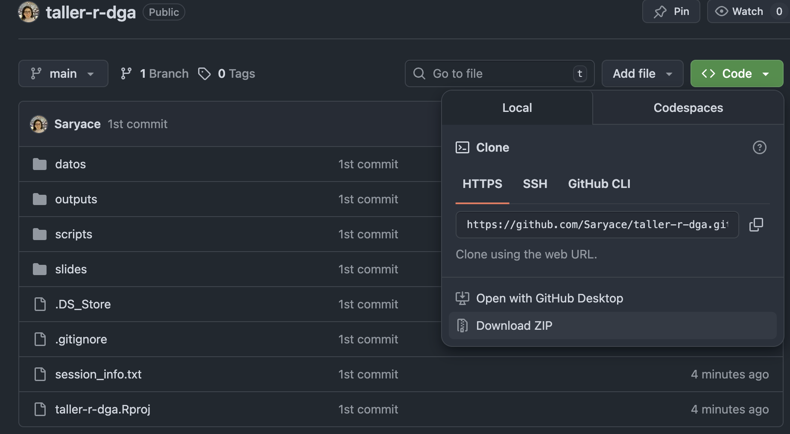

## Bienvenidos al repositorio de los talleres de R para la DGA

Lo dictaremos [Sara Acevedo](https://saryace.github.io) y [Alejandra Vega](https://alevega2702.github.io/qr_research-main/)

## Como descargar el código desde github:
Hacer click en el botón verde "code" y luego descargar en la opción "download zip"

## Material extra para los talleres Introductorios de R
- Como instalar R en Windows [acá video](https://www.youtube.com/watch?v=-ggIi6-asCo)
- Como instalar R en Mac [acá video](https://www.youtube.com/watch?v=OW66f1sBQOc)
- Libro R4DS [acá link](https://es.r4ds.hadley.nz/)

## Que aprenderemos?
- Importar y exportar datos
- Librería Tidyverse
- Buenas prácticas
- Quarto - reportes
